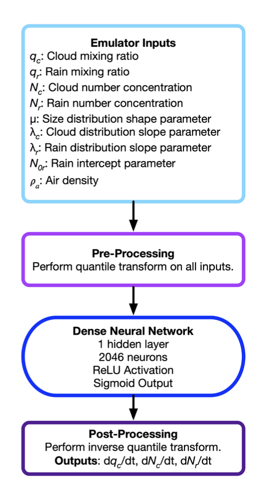

# Integrating ML emulators in the  Community Atmosphere Model (CAM)  using FTorch.

## Overview

This guide outlines the process of integrating Machine Learning (ML) emulators into the Community Atmosphere Model (CAM) using FTorch on NCAR's Derecho High-Performance Computing (HPC) system. FTorch serves as a bridge between PyTorch-based ML models and Fortran-based climate models, enabling the replacement or augmentation of traditional physics parameterizations with ML-based alternatives. 

## System Context

This documentation assumes you have:
- An active account on NCAR's Derecho system
- Basic familiarity with HPC environments and module systems

## What is FTorch?

FTorch is a specialized interface library that:

- Enables direct calling of PyTorch models from Fortran code
- Handles data type conversions between PyTorch tensors and Fortran arrays
- Manages computational resource allocation for ML inference
- Execute the model on either the CPU or GPU, ensuring seamless data handling from the respective hardware.
- Prioritize minimal performance overhead for optimal efficiency.

Visit https://github.com/alexeedm/pytorch-fortran to learn more about FTorch

##  Integration Benefits

- Replace computationally expensive physics parameterizations with efficient ML emulators
- Maintain the existing CAM workflow while incorporating ML capabilities
- Leverage PyTorch's extensive ML ecosystem within Fortran-based climate models
- Enable hybrid modeling approaches combining traditional physics with ML

###  Example 1 
It is the most basic type of PyTorch model integration with CAM using FTorch. 
We'll create a constant model that always returns ones, serving as a minimal working example.

###  1. Create the PyTorch Model

```bash
# constant_model.py
import torch
import torch.nn as nn

class ConstantModel(nn.Module):
    def __init__(self):
        super(ConstantModel, self).__init__()

    def forward(self, x):
        # Always return a tensor of ones with the same shape as input
        return torch.ones_like(x, dtype=torch.float)

# Instantiate the model
model = ConstantModel()

# Export to TorchScript format (required for FTorch)
model_scripted = torch.jit.script(model)

# Save the model
model_scripted.save("constant_model.pt")

# Test the model
example_input = torch.tensor([0.5])
output = model(example_input)
print(f"Test input: {example_input}")
print(f"Test output: {output}")
```

### 2. Test Model on Derecho

```bash
# Load required modules
module load conda
# if pytorch isn't installed in the conda enviroment, create the environment and install it
create --name pytorch_env
conda activate pytorch_env
conda install pytorch

# Run the Python script
python constant_model.py
```
The model 'constant_model.pt' will be generated

### 3. Create Fortran Interface

CAM-CESM code for this exercise can be obtained as following:
```bash
git clone https://github.com/jedwards4b/cesm.git cesm2.1-alphabranch-ftorch
cd cesm2.1-alphabranch-ftorch/
./manage_externals/checkout_externals
```

Create a file named pytorch_test.F90 in your CAM source directory. The recommended location is:
```bash
vi  components/cam/src/physics/cam/pytorch_test.F90
```

In your Fortran interface file, specify the path to your PyTorch model:

```fortran
module pytorch_test

  use shr_kind_mod, only: r8 => shr_kind_r8

  use ftorch, only : torch_model, torch_model_load, torch_model_forward, &
          torch_tensor, torch_tensor_from_array, torch_kCPU,  torch_delete

  use iso_fortran_env

  implicit none
  save

  character(len=256) :: cb_torch_model = "/path/constant_model.pt"
  type(torch_model) :: model_pytorch

  public init_neural_net, neural_net

contains

  subroutine init_neural_net()
    implicit none
    call torch_model_load(model_pytorch, trim(cb_torch_model))
  end subroutine init_neural_net

  subroutine neural_net()
     implicit none
     integer              :: in_layout(1) = [1]
     integer              :: out_layout(1) = [1]

     ! NN variables
     type(torch_tensor), dimension(1) :: in_tensor, out_tensor
     real(real32) :: in_data(1) = 1.0
     real(real32), dimension(1) :: out_data

     call torch_tensor_from_array(in_tensor(1), in_data, in_layout, torch_kCPU) ! Ftorch
     call torch_tensor_from_array(out_tensor(1), out_data, out_layout, torch_kCPU)
    call torch_model_forward(model_pytorch, in_tensor, out_tensor)

  end subroutine neural_net

end module pytorch_test

```

### 4. Integrate with CAM


Make sure the Fortran interface 'pytorch_test.F90' in the 'src/physics/cam'. 
Then edit 'physpkg.F90' file:

```bash
vi src/physics/cam/physpkg.F90
```
Insert the following line at the beginning of the file
```fortran
use pytorch_test,        only: init_neural_net, neural_net
```

At the end of subroutine 'phys_init', add the following:
```fortran
 ! Test for neural network initialization
    call init_neural_net()

    ! Test for neural network run
    call neural_net()
```

### 5. Compile and RUN

Compile the CAM model, in this case we used gnu compiler. 
```bash
./cime/scripts/create_newcase --case /path/test_ftorch --mach derecho --compiler gnu --compset FHIST --res f09_f09_mg17 --project your project number
```


Export FTorch environment:
```bash
export USE_FTORCH=TRUE
export FTORCH_PREFIX_FTORCH=/root/ftorch/install/path
export CONDA_PREFIX=FALSE
```
Setup, build and submit

```bash
./case.setup
./case.build 
./xmlchange STOP_OPTION=ndays
./xmlchange STOP_N=1
./xmlchange RESUBMIT=0
./xmlchange JOB_WALLCLOCK_TIME=00:20:00
./xmlchange PROJECT=your project number
./case.submit
```


###  Example 2

This example provides a simple but complete demonstration of how to use the FTorch library.

###  1. Create the PyTorch Model

The model defines a very simple PyTorch 'net' that takes an input vector of length 5 and applies a single Linear layer to multiply it by 2.


Create a file named simplenet.py in your working directory. 
```bash
vi  simplenet.py 
```
The following script consists of a single Linear layer with weights predefined to
multiply the input by 2.

```bash
import torch
from torch import nn

class SimpleNet(nn.Module):
    def __init__(self,) -> None:
        super().__init__()
        self._fwd_seq = nn.Sequential(
            nn.Linear(5, 5, bias=False))
        with torch.no_grad():
            self._fwd_seq[0].weight = nn.Parameter(2.0 * torch.eye(5))

    def forward(self, batch: torch.Tensor) -> torch.Tensor:
        return self._fwd_seq(batch)

if __name__ == "__main__":
    model = SimpleNet()
    model.eval()

    # Export to TorchScript format (required for FTorch)
    model_scripted = torch.jit.script(model)

    # Save the model
    model_scripted.save("simplenet_model.pt")

```

### 2. Test Model on Derecho

```bash
# Load required modules
module load conda
# if pytorch isn't installed in the conda enviroment, create the environment and install it
create --name pytorch_env
conda activate pytorch_env
conda install pytorch

# Run the Python script
python simplenet.py
```
The model 'simplenet_model.pt' will be generated


### 3. Create Fortran Interface

CAM-CESM code for this exercise can be obtained as following:
```bash
git clone https://github.com/jedwards4b/cesm.git cesm2.1-alphabranch-ftorch
cd cesm2.1-alphabranch-ftorch/
./manage_externals/checkout_externals
```

Create a file named cam_nn.F90 in your CAM source directory. The recommended location is:
```bash
vi  components/cam/src/physics/cam/cam_nn.F90
```

```bash
module cam_nn
#ifdef USE_FTORCH
  use ftorch,         only: torch_kCPU, torch_tensor, torch_model, torch_tensor_from_array
  use ftorch,         only: torch_model_load, torch_model_forward, torch_tensor_delete
  use camsrfexch,     only: cam_in_t
  use physics_types,  only: physics_state
  use shr_kind_mod,   only: CL=>shr_kind_cl
  !use spmd_utils,     only: masterproc
  use cam_abortutils,only: endrun
  use cam_logfile ,   only:iulog
  ! Import precision info from iso
  use, intrinsic :: iso_fortran_env, only : sp => real32
  use namelist_utils,  only: find_group_name
  use spmd_utils,     only: masterproc
  implicit none

  public :: torch_inference, torch_readnl

  ! Declare the torch model without initializing it here
  type(torch_model)  :: model
  logical            :: model_initialized = .false.
  character(len=CL) :: weights_file

contains

  subroutine torch_readnl(nlfile)
    use namelist_utils, only : find_group_name
    use units,          only : getunit, freeunit
    use spmd_utils,      only: mpicom, mstrid=>masterprocid, mpi_character, masterproc
    character(len=*), intent(in) :: nlfile
    integer :: unitn
    integer :: ierr
    character(len=*), parameter :: sub="torch_readnl"

    namelist /torch_nl/ weights_file

    if(masterproc) then
       unitn = getunit()
       open( newunit=unitn, file=trim(nlfile), status='old' )
       call find_group_name(unitn, 'torch_nl', status=ierr)
       if (ierr == 0) then
          read(unitn, torch_nl, iostat=ierr)
          if (ierr /= 0) then
             call endrun(sub//': FATAL: reading namelist')
          end if
       end if
       close(unitn)
       call freeunit(unitn)
    endif

    ! Broadcast namelist variables
    call mpi_bcast(weights_file, len(weights_file), mpi_character, mstrid, mpicom, ierr)

  end subroutine torch_readnl

  subroutine init_torch_model(model)
    ! Initialize the model
    type(torch_model), intent(inout) :: model
    character(len=*), parameter :: sub="init_torch_model"

    call torch_model_load(model, weights_file, torch_kCPU)
  end subroutine init_torch_model

  subroutine torch_inference
    implicit none

    ! Set working precision for reals
    integer, parameter :: wp = sp

    type(torch_model) :: model
    type(torch_tensor), dimension(1) :: in_tensors
    type(torch_tensor), dimension(1) :: out_tensors

    real(wp), dimension(5), target :: in_data
    real(wp), dimension(5), target :: out_data

    ! Define tensor shape
    integer      :: tensor_layout(1) = [1]

    ! Initialize the model if it has not been initialized yet
    if (.not. model_initialized) then
       call init_torch_model(model)
       model_initialized = .true.
    end if

    ! Initialise data
    in_data = [0.0_wp, 1.0_wp, 2.0_wp, 3.0_wp, 4.0_wp]

    call torch_model_load(model, trim(weights_file))

    ! Make Torch Tensors for input and output
    call torch_tensor_from_array(in_tensors(1), in_data,    tensor_layout, torch_kCPU)

    call torch_tensor_from_array(out_tensors(1), out_data, tensor_layout, torch_kCPU)

    ! Perform inference
    call torch_model_forward(model, in_tensors, out_tensors)

    ! Free the torch tensors
    call torch_tensor_delete(in_tensors(1))

    call torch_tensor_delete(out_tensors(1)) 
  end subroutine torch_inference
#endif
end module cam_nn

```

In your Fortran interface file, the path to the PyTorch model is indicated through the namelist, and you need to edit the following files:

```bash
vi  components/cam/bld/namelist_files/namelist_definition.xml
```
Append the following text at the end of the file

```bash
<entry id="weights_file" type="char*256" input_pathname="abs" group="torch_nl" valid_values="">
  Path to Neural Network weights file
        Default: set by build-namelist
</entry>
```
```bash
vi components/cam/src/control/runtime_opts.F90
```

Add the following line the few lines of the script
```bash 
use cam_nn,              only: torch_readnl
```

### 4. Integrate with CAM

Make sure the Fortran interface 'cam_nn.F90' in the 'src/physics/cam'. 
Then edit 'physpkg.F90' file:

```bash
vi src/physics/cam/physpkg.F90
```
Insert the following line at the beginning of the file
```fortran
#ifdef USE_FTORCH
  use cam_nn,             only: torch_inference
#endif
```

At the end of subroutine 'phys_init', add the following:
```fortran
 ! Test for neural network initialization
 #ifdef USE_FTORCH
    call torch_inference 
 #endif
```

## 5. Compile and RUN

```bash

```
Compile the CAM model, in this case we used gnu compiler. 
```bash
./cime/scripts/create_newcase --case /path/test_ftorch --mach derecho --compiler gnu --compset FHIST --res f09_f09_mg17 --project your project number
```

You need to specify the path of pytorch model in your 'user_nl_cam' file in the case directory, you need to write:

```bash
 vi user_nl_cam
 weights_file = '/path/simplenet_model.pt'
```

Export FTorch environment:
```bash
export USE_FTORCH=TRUE
export FTORCH_PREFIX_FTORCH=/root/ftorch/install/path
export CONDA_PREFIX=FALSE
```
Setup, build and submit

```bash
./case.setup
./case.build 
./xmlchange STOP_OPTION=ndays
./xmlchange STOP_N=1
./xmlchange RESUBMIT=0
./xmlchange JOB_WALLCLOCK_TIME=00:20:00
./xmlchange PROJECT=your project number
./case.submit
```
###  Example 3 - Integration of ML Warm Microphysics 

Integrating a ML based parameterization for warm rain microphysics into the Community Earth System Model (CESM) using the FTorch interface. The integration enables CESM to emulate microphysical tendencies using a PyTorch-trained neural network and associated quantile transformation functions.


## 1. Overview

The integration includes four main components:
- Model Initialization: Loads the TorchScript model and quantile scaling files.
- Neural Network Prediction: Performs batched inference using FTorch.
- Microphysical Emulation: Applies the ML model to compute physical tendencies.
- Quantile Transformation: Scales inputs/outputs to match the ML model’s training distribution.

## 2. Subroutine: 'initialize_tau_emulators'

Initializes the neural network model and loads the associated quantile scaling parameters.

Inputs:
- 'stochastic_emulated_filename_quantile': Path to the TorchScript model.
- 'stochastic_emulated_filename_input_scale': Path to input scaling file.
- 'stochastic_emulated_filename_output_scale': Path to output scaling file.
- 'iulog': Log file unit.
- 'errstring': Error message output.

Actions:
- Loads the neural network model using 'init_neural_net'.
- Loads input/output scaling files using 'load_quantile_scale_values'.


## 3. Subroutine: 'init_neural_net'

Loads the TorchScript model into memory using FTorch.

Inputs:
- 'filename': Path to TorchScript model (`.pt`).
- 'batch_size': Batch size for inference.
- 'iolog': Log file unit.

Outputs:
- 'model_ftorch': FTorch model handle.
- 'errstring': Error message output.

Details:
- Uses 'torch_model_load()' to read the model.
- Logs success and model properties.


## 4. Subroutine: 'tau_emulated_cloud_rain_interactions'

Performs the core emulation of cloud-rain microphysics using the neural network.

Inputs:
- Physical state variables: 'qc', 'qr', 'nc', 'nr', 'pgam', 'lamc', 'lamr', 'n0r', 'rho'
- Constants: 'mgncol', 'q_small'

Outputs:
- Microphysics tendencies: 'qc_tend', 'qr_tend', 'nc_tend', 'nr_tend'

 Workflow:
1. Construct 'nn_inputs' vector.
2. Apply 'quantile_transform()' to match ML model scaling.
3. Run forward inference using 'neural_net_predict()'.
4. Invert transformation with 'quantile_inv_transform()'.
5. Assign outputs to prognostic tendency variables.


## 5. Subroutine: 'neural_net_predict'

 Executes the model forward pass.

Inputs:
- 'input': Input array (2D, physical variables).
- 'model_ftorch': TorchScript model loaded via FTorch.
- 'iulog': Log file unit.

Outputs:
- 'prediction': Model output array (2D).

Notes:
- Supports batched input.
- Manages precision conversion.
- Uses 'torch_tensor_from_array()' and 'torch_model_forward()' from FTorch.


## 6. Quantile Transformation Utilities

### 'quantile_transform'
- Applies input scaling using quantile values stored during training.

### 'quantile_inv_transform'
- Inverts model outputs back to physical units for use in CESM.

These functions ensure consistency between the ML model’s training distribution and runtime execution in CESM.


## 7. FTorch CESM Interface Module: 'FTorch_cesm_interface.F90'
 
Provides an abstraction for FTorch operations in CESM, enabling model loading and inference through Fortran.

```fortran
module FTorch_cesm_interface
```

### FTorch-Enabled Case ('USE_FTORCH=TRUE')
Uses FTorch library:

```fortran
use ftorch, only: torch_kCPU, torch_tensor, torch_model
use ftorch, only: torch_model_load, torch_model_forward, torch_tensor_from_array, torch_delete
```

### Fallback Case (FTorch Disabled)

Defines dummy routines that abort execution:

```fortran
call shr_abort_abort("ERROR: Using FTorch Interface without USE_FTORCH=TRUE")
```

### Key Routines

| Subroutine                 | Purpose                                  |
|----------------------------|------------------------------------------|
| `torch_model_load`         | Load a TorchScript model.                |
| `torch_tensor_from_array`  | Convert Fortran array to FTorch tensor.  |
| `torch_model_forward`      | Perform inference.                       |
| `torch_delete`             | Free allocated Torch object.             |

### Types Defined

- 'torch_model' : Neural net handle.
- 'torch_tensor': Input/output tensor handle.


## 8. Model Requirements

To ensure compatibility with the FTorch interface, the ML model must:
- Be saved in 'TorchScript' format ('torch.jit.save()').
- Use consistent 'input feature order*':  
  'qc', 'qr', 'nc', 'nr', 'pgam', 'lamc', 'lamr', 'n0r', 'rho'.
- Include 'quantile transformation files' for inputs and outputs 


## 9. Compile and RUN

```bash

```
Obtain the CAM version/branch that integrates ML warm microphysics using FTorch and Compile the CAM model.  
```bash
git clone https://github.com/addisug/CAM.git -b cam6_4_046_ftorch
./bin/git-fleximod update

./cime/scripts/create_newcase --case /path/test_ftorch --mach derecho  --compset F2000climo --res f09_f09_mg17 --project your project number

./xmlchange USE_FTORCH=TRUE,CAM_CONFIG_OPTS="-phys cam7 -cosp"

./case.setup
```

You need to specify the path of pytorch model and the input/output scale in your 'user_nl_cam' file in the case directory, you need to write:

```bash
 vi user_nl_cam
 stochastic_emulated_filename_quantile = '/glade/work/addisus/mlmicrophysics/tau_run_10/input_output_1193/quantile_neural_net_v2.pt'
 stochastic_emulated_filename_input_scale = '/glade/work/addisus/mlmicrophysics/tau_run_10/input_output_1193/input_quantile_scaler.nc'
 stochastic_emulated_filename_output_scale = '/glade/work/addisus/mlmicrophysics/tau_run_10/input_output_1193/output_quantile_scaler.nc'
```

Build and submit

```bash
./case.build 
./xmlchange STOP_OPTION=ndays
./xmlchange STOP_N=1
./xmlchange RESUBMIT=0
./xmlchange JOB_WALLCLOCK_TIME=00:20:00
./xmlchange PROJECT=your project number
./case.submit
```